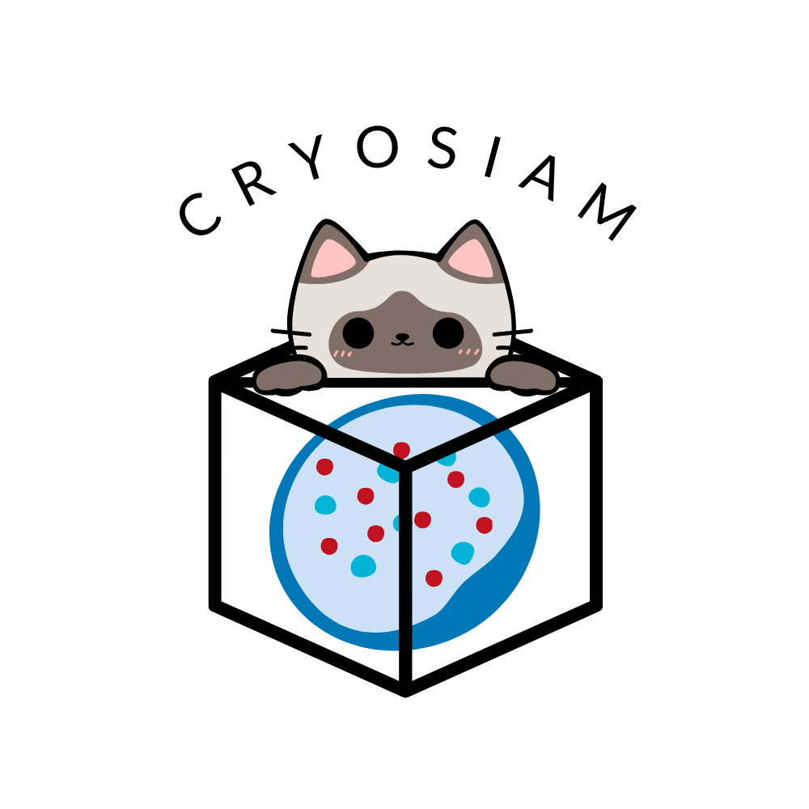

# CryoSiam 




Self-supervised deep learning framework that works on dense and subtomogram levels. The dense part of the framework is additionally trained on subtasks for tomogram denoising, tomogram semantic and instance segmentation. 

Demo beta version of CryoSiam - to try out the denoising of tomograms with pre-trained models follow the steps in the provided [Colab notebook](https://github.com/frosinastojanovska/cryosiam_beta/blob/main/tomogram_denoising.ipynb).

Other downstream tasks (semantic and instance segmentation) will come very soon!!!


# Setup

1. Clone this repository.
2. Clone the CryoSiam-beta dependency into the project root:
    ```
   git clone https://github.com/frosinastojanovska/cryosiam_beta.git
   ```
3. Install requirements:
   ```
   pip install -r requirements.txt
   ```
4. Run the script as described...